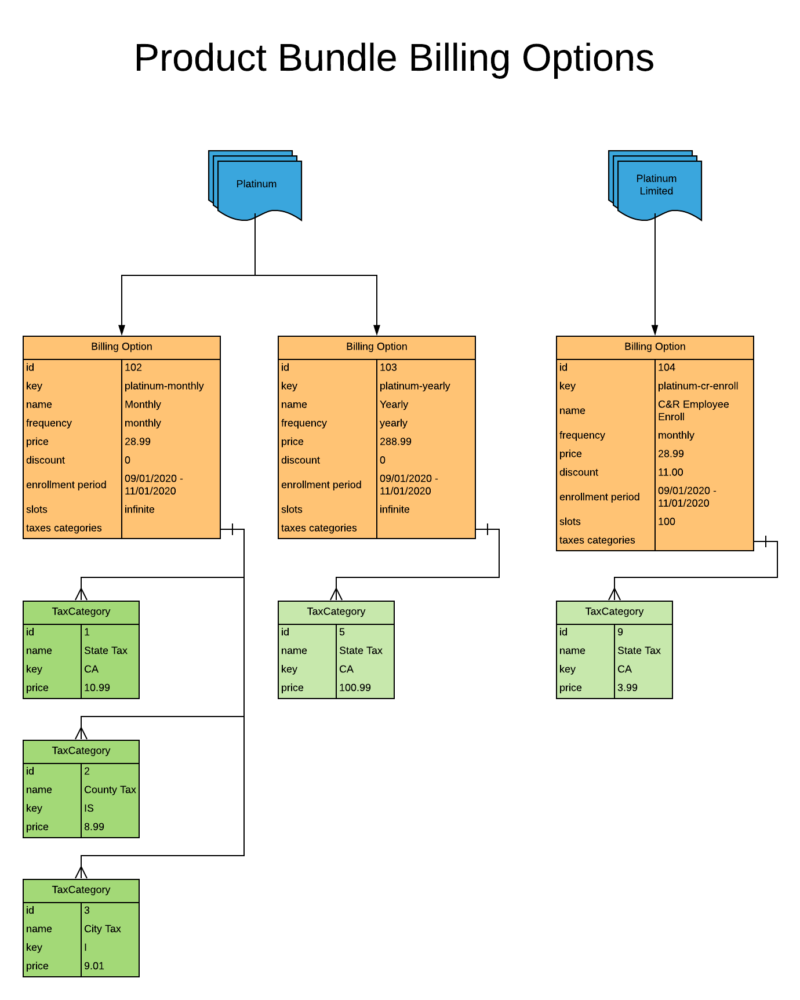

# Billing Options Explained

 - [Overview](#user-content-overview)
 - [Visual](#user-content-visual)
 - [Example Explained](#user-content-example-explained)
 - [Next Section](#user-content-next-section)

## Overview
Billing Options are essentially the symantics of a Product Bundle when a Contact
is creating a Subscription.

They dictate the price, the enrollment period dates, any special key's that are 
used for the sign up forms.

## Visual

## Example Explained

## Next Section

[Product Packages Explained](ProductPackagesExplained.md)

[Back To Introduction](../Introduction.md)