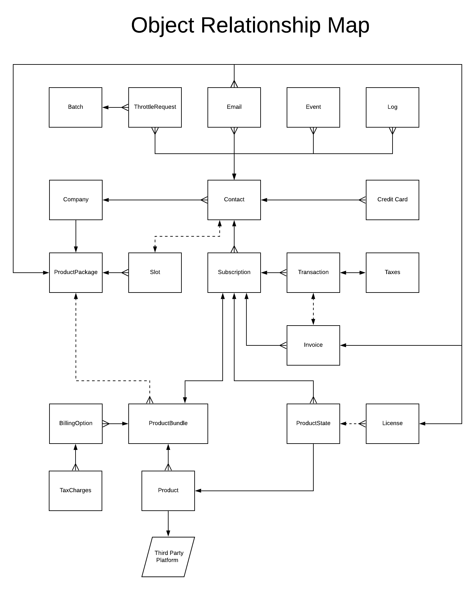

# Objects And Relationships

 - [Overview](#user-content-overview)
 - [Visual](#user-content-visual)
 - [New Verbiage](#user-content-new-verbiage)
    - [Product](#user-content-product)
    - [Product Bundle](#user-content-product-bundle)
    - [Billing Option](#user-content-billing-option)
    - [Product State](#user-content-product-state)
 - [Primary Object - The Contact Object](#user-content-primary-object-the-contact-object)
    - [Contact Enrollment Journery Example](#user-content-contact-enrollment-journery-example)
 - [More Information](#user-content-more-information)
 - [Next Section](#user-content-next-section)

## Overview
At the highest level, this is the relationship between all the Core Objects operating 
within the system. On the platform level, all Objects will all have the ability to traverse 
this map to find any long distance relationship, such as a License finding it's owner Contact.

## Visual

---

## New Verbiage
In the old version of Core, Platinum and Platinum Plus were their own Products. This has now
changed slightly - now they are considered Product Bundles.

This is because in the new v2.1.0 system, we now have a more dynamic means of mixing and matching
the various services and purchasable options that we offer.

For this to work though, there is some verbiage changes for the third party services and integrations 
that we connect our customers too, such as Experian, ACN and AntiVirus. These are now called
the Products in our system, and what was Platinum and Platinum Plus are now called the Product
Bundles.

This way we can create a Product Bundle with any number of combinations of Products.

This new system comes with some new Objects and verbiage that you will want to be familiar with.
Most of the common Objects are the same, but some of the new or changes ones are below.

 - [Product](#user-content-product)
 - [Product Bundle](#user-content-product-bundle)
 - [Billing Option](#user-content-billing-option)
 - [Product State](#user-content-product-state)

### Product
This now represents one of our services, such as Experian, AntiVirus, or even ACN. 

These are hard coded into the system and have their own means of registering, enrolling, 
activating (de/reactivating), and any other special need the Product has such as Licenses 
and checking for Authentication status.

### Product Bundle
This is a group of Products that will be offered to end users when they are signing up, such as
Platinum - which is a combination of the Experian and ACN Products.

### Product Package
This is a group of Products Bundles, usually as an offer to a Company. It is responsible for 
defining which Product Bundles are available, the enrollment period and available slots if desired.

### Billing Option
A Billing Option belongs to a Product Bundle, and defines the frequency and price of a Subscription.
It is also responsible for the Tax Categories applied to the Transaction.

When a Contact creates a Subscription for a Product Bundle, they are really creating it for the 
Billing Option they selected for that particular Product Bundle. For example, a Subscription for
the Platinum Monthly is really a Subscription for the "Monthly" Billing Option for the "Platinum"
Product Bundle.

### Product State
When a Contact creates a new Subscription, a Product State is created for each Product available 
in the Product Bundle. These Product States manage the current status, licenses, or any other necessary 
data for the Contacts state with the Product.

For example, a Subscription to the "Platinum" Product Bundle would have two Product States.
 1. Product State: Experian
 2. Product State: ACN

Each of these states would hold information on status, activation and authentication, errors, etc.

---

## Primary Object - The Contact Object
The primary Object in Core is the Contact Object. Most all functions are done through or with
a Contact Object in context. This includes Companies, which perform their actions through a 
Point Of Contact (aka POC) Contact Object, which will hold the respective Subscription. 

Even Product Bundles, Products and Billing Options are essentially only utilized in reference
to either a Contact or their Subscription.

The only exception to this is a Batch Object, which is used by the Throttler to run a group of
Throttle Requests.

### Contact Enrollment Journery Example

Take for example the sign up process through the OEP:

 - User submits data to sign up for the "Monthly" BillingOption for the "Platinum" ProductBundle.
 - Contact is created.
 - Contact creates Credit Card.
 - Contact creates Subscription for the "Monthly" BillingOption for the "Platinum" ProductBundle.
    - Subscription creates a ProductState for each Product in ProductBundle.
 - Subscription creates a Transaction with the Contact Credit Card.
    - Transaction creates TaxCharges based on BillingOption TaxCategories and Contact zip.
 - Subscription creates an Invoice.
 - Transaction attempts an Authorization and on success Charges.
 - Subscription activates all ProductStates
    - ProductState creates License if Product requires it.  
    

---

## More Information
If you'd like to learn more about the Objects, you can see the [Core Objects Developer Documentation](../Objects.md).

---

## Next Section

[Products Explained](ProductsExplained.md)

[Back To Introduction](../Introduction.md)