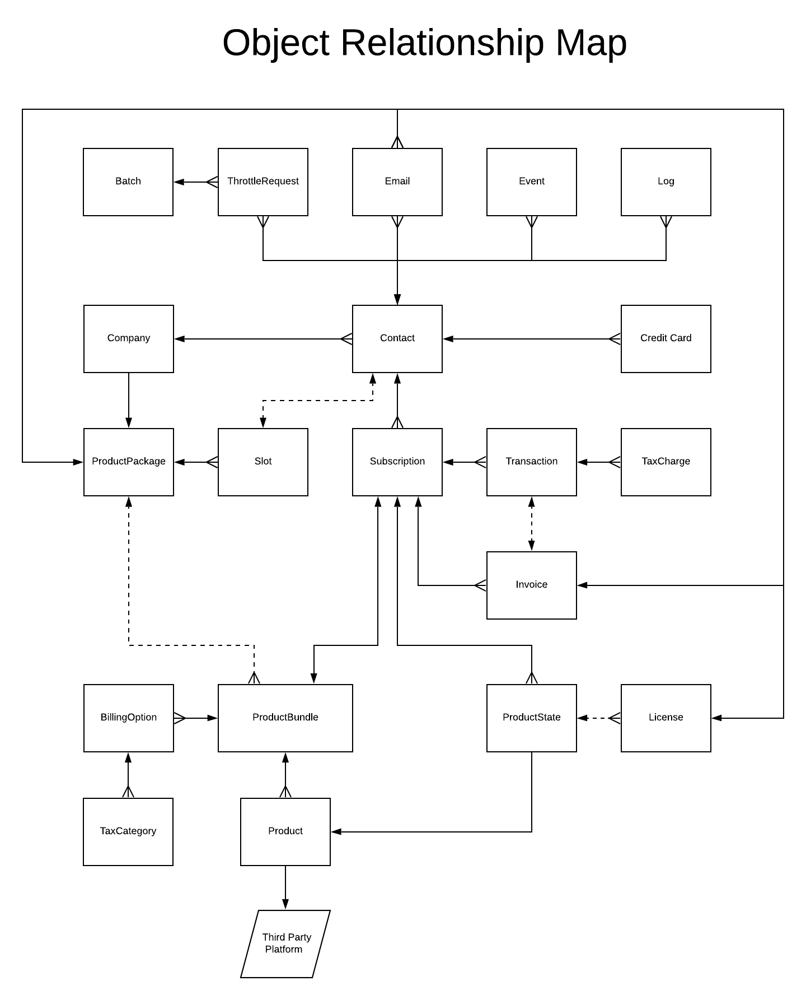

# Objects And Relationships

 - [Visual](#markdown-header-visual)
 - [Overview](#markdown-header-overview)
    - [Primary Object - The Contact Object](#markdown-header-primary-object-the-contact-object)
 - [More Information](#markdown-header-more-information)
 - [Next Section](#markdown-header-next-section)

## Visual

## Overview
At the highest level, this is the relationship between all the Core Objects operating 
within the system. On the platform level, all Objects will all have the ability to traverse 
this map to find any long distance relationship, such as a License finding it's owner Contact.

### Primary Object - The Contact Object
The primary Object in Core is the Contact Object. Most all functions are done through or with
a Contact Object in context. This includes Companies, which perform their actions through a 
Point Of Contact (aka POC) Contact Object, which will hold the respective Subscription. 

Even Product Bundles, Products and Billing Options are essentially only utilized in reference
to either a Contact or their Subscription.

The only exception to this is a Batch Object, which is used by the Throttler to run a group of
Throttle Requests.

#### Contact Enrollment Journery Example

Take for example the sign up process through the OEP:

 - User submits data to sign up for the "Monthly" BillingOption for the "Platinum" ProductBundle.
 - Contact is created.
 - Contact creates Credit Card.
 - Contact creates Subscription for the "Monthly" BillingOption for the "Platinum" ProductBundle.
    - Subscription creates a ProductState for each Product in ProductBundle.
 - Subscription creates a Transaction with the Contact Credit Card.
    - Transaction creates Taxes based on BillingOption TaxCharges and Contact zip.
 - Subscription creates an Invoice.
 - Transaction attempts an Authorization and on success Charges.
 - Subscription activates all ProductStates
    - ProductState creates License if Product requires it.  

## More Information
If you'd like to learn more about the Objects, you can see the [Core Objects Developer Documentation](../Objects).

## Next Section

[Product Bundles Explained](ProductBundlesExplained)

[Back To Introduction](../Introduction)