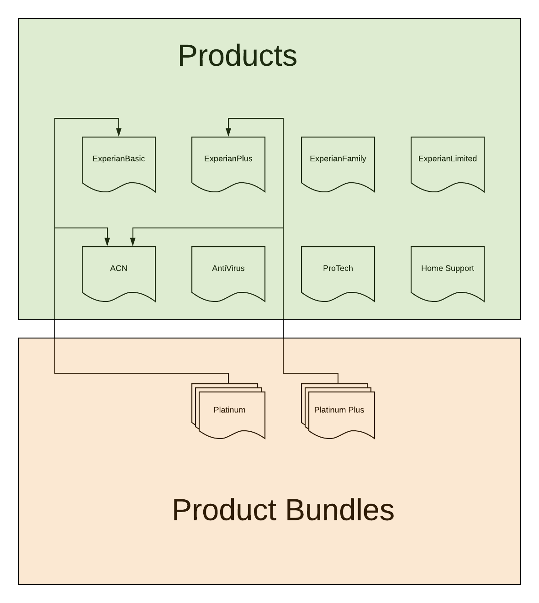

# Objects And Relationships

 - [Visual](#markdown-header-visual)
 - [Overview](#markdown-header-overview)
    - [Primary Object - The Contact Object](#markdown-header-primary-object-the-contact-object)
 - [More Information](#markdown-header-more-information)
 - [Next Section](#markdown-header-next-section)

## Visual

## Overview
At the highest level, this is the relationship between all the Core Objects operating 
within the system. On the platform level, all Objects will all have the ability to traverse 
this map to find any long distance relationship, such as a License finding it's owner Contact.

## More Information
If you'd like to learn more about the Objects

## Next Section

[Product Packages Explained](ProductPackagesExplained)

[Back To Introduction](../Introduction)