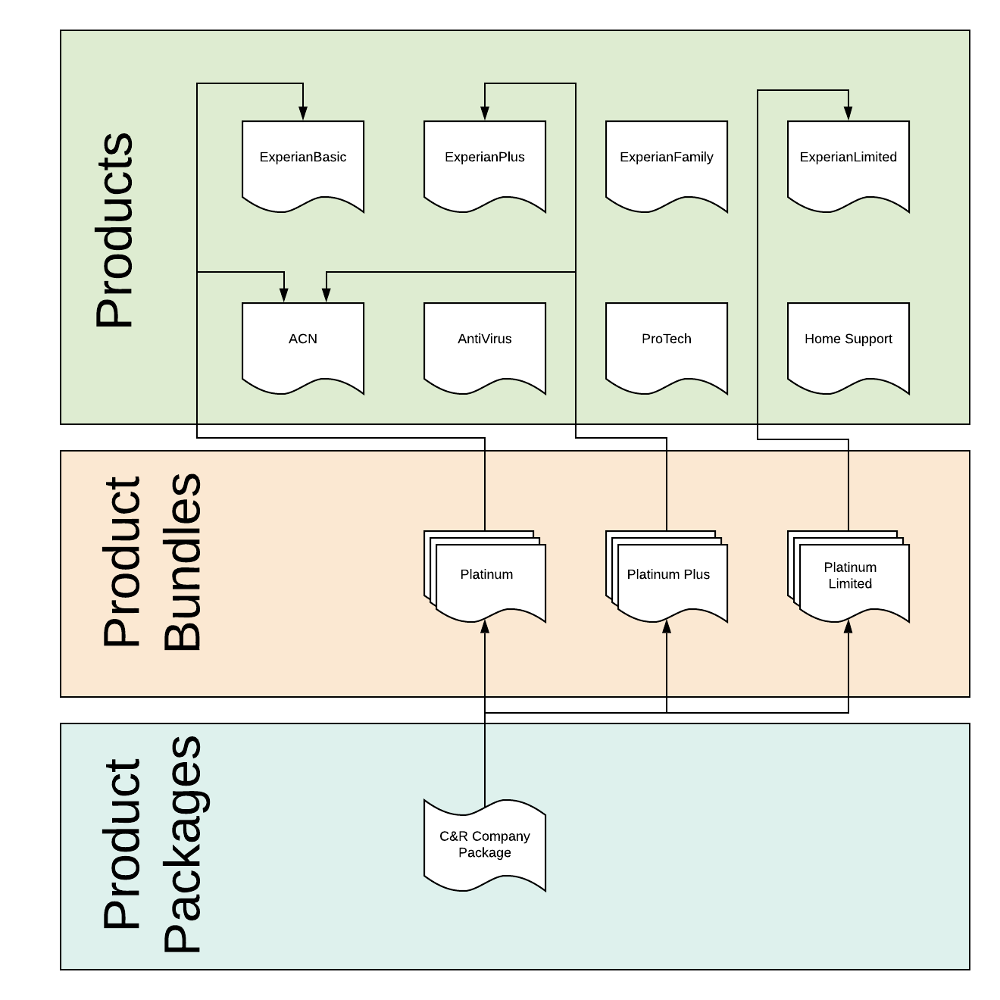

# Objects And Relationships

 - [Visual](#markdown-header-visual)
 - [Overview](#markdown-header-overview)
    - [Primary Object - The Contact Object](#markdown-header-primary-object-the-contact-object)
 - [Next Section](#markdown-header-next-section)

## Visual

## Overview

## Next Section

[Billing Options Explained](BillingOptionsExplained)

[Back To Introduction](../Introduction)