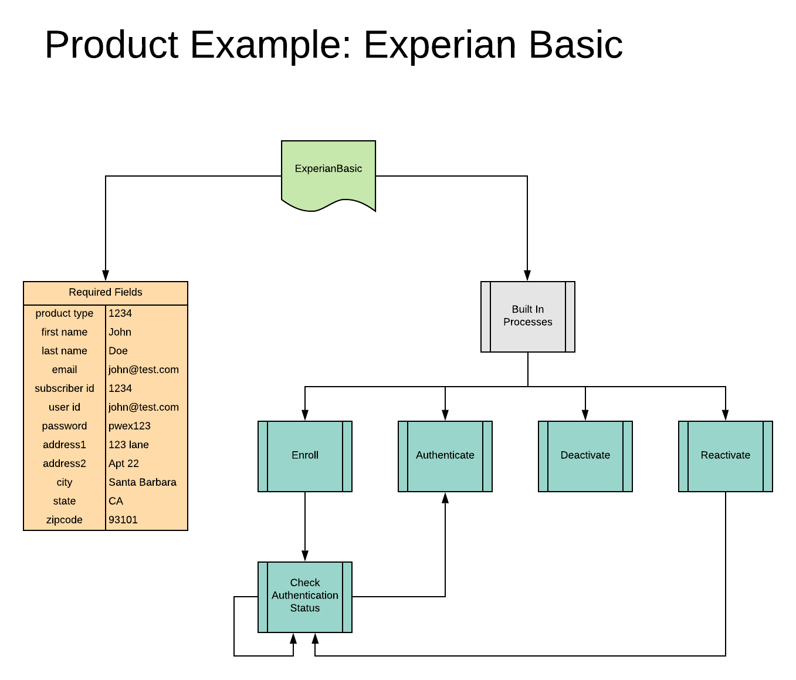

# Products Explained

 - [Overview](#user-content-overview)
 - [Visual](#user-content-visual)
 - [Example Explained](#user-content-example-explained)
 - [Product States](#user-content-product-states)
 - [Next Section](#user-content-next-section)

## Overview
A Product is the Object representation of one of the many services we connect a customer 
too. On the surface level, it is the container that holds the data for services - such as 
IDs that are communicated to other systems, API keys, how many Licenses have been issued, 
and of coarse name and description, etc.

But below the surface, the Product Object is responsible for taking the information from a
Subscription, such as Contact and Billing Option, and then managing that data with the third
party services through APIs or Core systems such as the Throttler.

A Product will be responsible for the enrollment, activation, and any other creation, update or
remove functions needed for a Contact and that Product's third party services. This also includes
being responsible for License distribution and monitoring.

## Visual

## Example Explained
In the above example, we can see the Experian Basic Product in more detail.

Each Product can define what fields it requires, as well as any formatting or defaults, in order 
to operate with the third party service. These fields are mapped from the Contact Object and 
transformed into the appropriate field names for the third party API method being invoked.

A Product also will have several Built In Processes that handle the various features of the third
party service, as well as managing the Contact and Product States. 

For example, above we see that the Experian Basic Product will Enroll a Contact, then loop a 
Authentication Check process. From there it can Authenticate, Deactivate or Reactivate.

---

## Product States
When a Contact creates a Subscription for a Product Bundle, the system will create a Product
State Object for each Product in the Product Bundle. 

What this means is that while the Product handles all the operations and features of the third
party services, a Contact's actual data, status, etc. is all stores in a Product State.

So when a Contact is Deactivated, the Product will take the information in the Product State,
perform the necessary deactivation functions with the third party service, and then update the
Product State's status as Deactivated.

---

## Next Section

[Product Bundles Explained](ProductBundlesExplained.md)

[Back To Introduction](../Introduction.md)